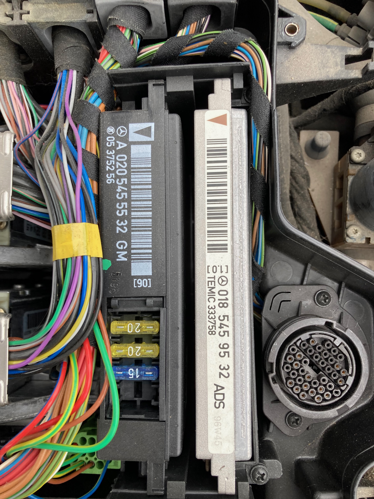
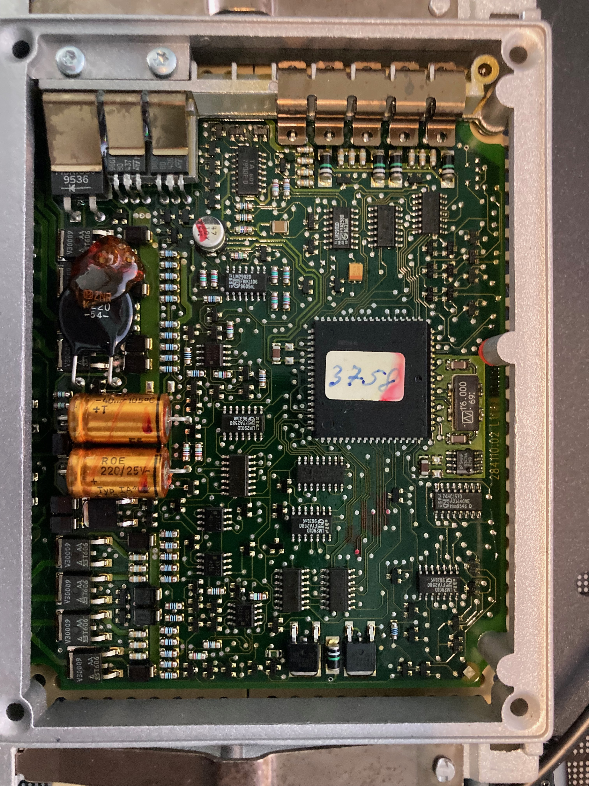

# r129_ads_0185459532
Investigations into the MB SL600 ADS2 control module

<table>
  <tr>
    <td> </td>
    <td></td>
   </tr> 
   <tr>
      <td></td>
      <td>
  </td>
  <tr>
      <td></td>
      <td>
  </td>
  </tr>
</table>

